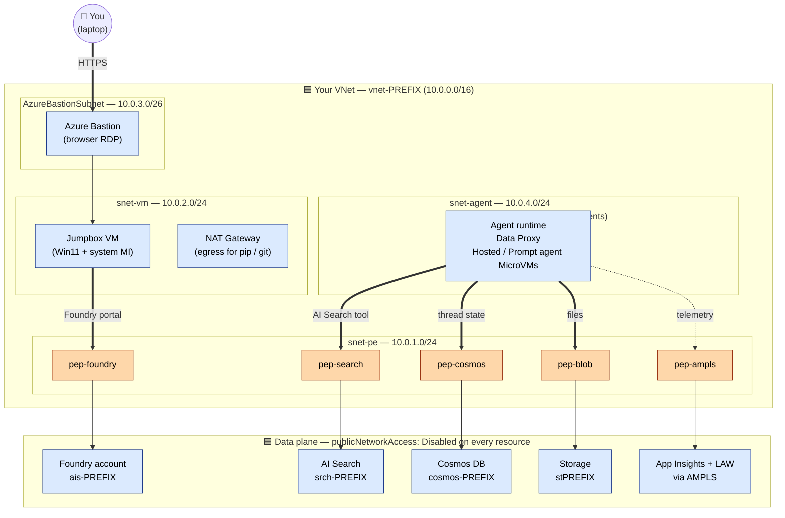
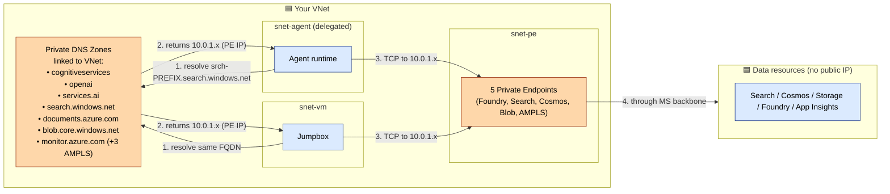
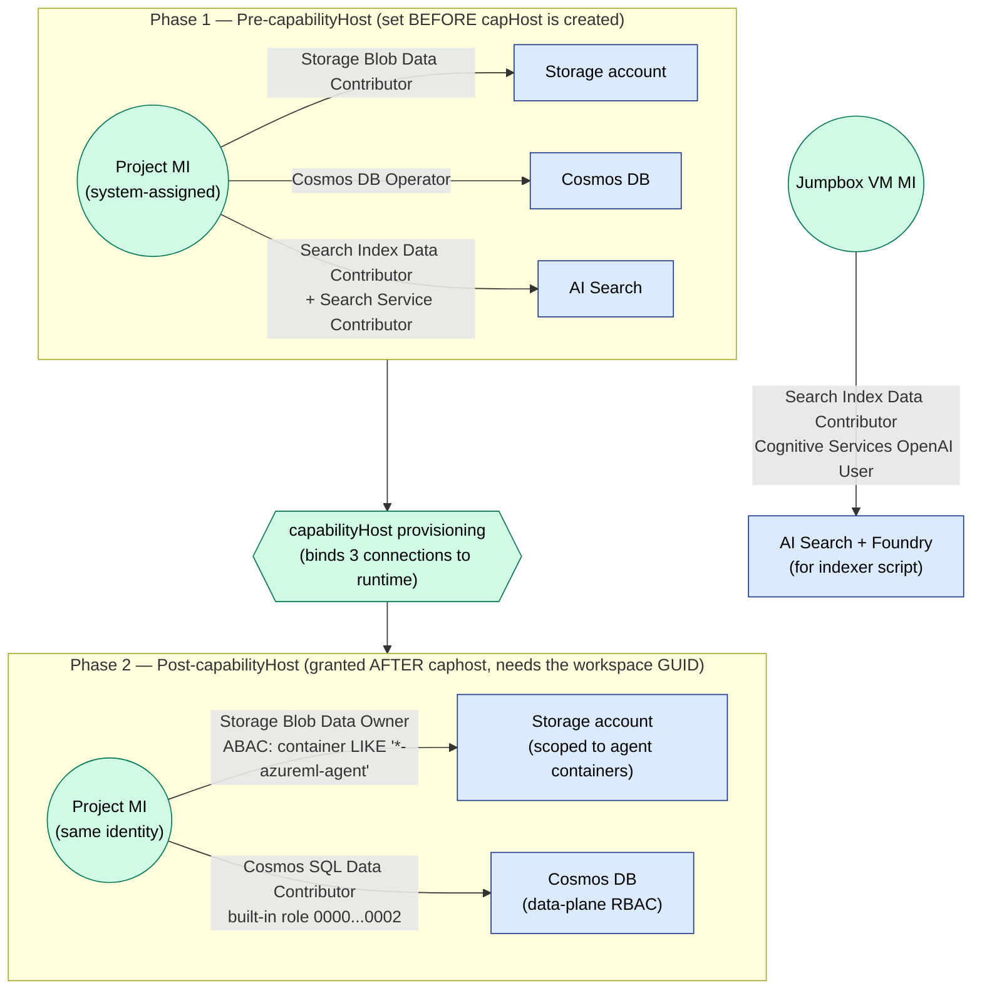
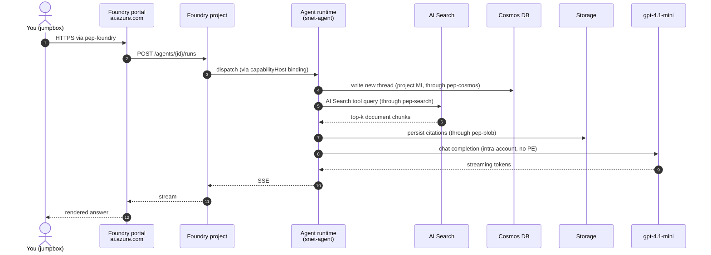

# Architecture Diagrams — BYO VNet flavor

Four diagrams, each answering one question. Read them top-to-bottom on first visit; jump straight to a specific one on follow-ups. All diagrams use the same colour legend so concepts stay recognisable across views.

## Colour legend

| Colour | Meaning |
|---|---|
| 🟦 Blue | **Your** VNet, subnets, resources, identities |
| 🟪 Purple | **Microsoft-managed** components (only the Foundry control plane in this flavor — the agent runtime is in *your* VNet) |
| 🟧 Orange | **Private Endpoint / DNS** — every PE in this template is yours |
| 🟩 Green | **Identity / RBAC** — managed identities and role assignments |

There is **no grey path** — the entire architecture is private. If you ever see a "public internet" arrow, that's a bug.

---

## 1. Solution context — what did we deploy and why?

The big picture. One VNet, all PEs in your subnet, the agent compute lives in *your* delegated subnet (this is what makes it "BYO"). Foundry's control plane is the only Microsoft-managed piece — and it's reached through a PE too.

**Three things to notice:**

1. There is **one** VNet. The agent runtime lives in your `snet-agent`, not in a separate Microsoft VNet. That's the "BYO" essence.
2. Every arrow into a data resource passes through a 🟧 PE. There is no public internet path on any flow.
3. The jumpbox + Bastion exist purely so you can reach the *portal* privately — they're not in the agent's hot path.

---

## 2. Network topology — where does every packet go?

Same components, drawn to make the **DNS resolution path** explicit. This is the diagram you want during troubleshooting.

**Debugging tip:** if any consumer (`RUNTIME` *or* `JMP`) can't reach a backend, step through this diagram in order:

1. **DNS** — does `nslookup` return a `10.0.1.x` IP? If not, the private DNS zone isn't linked to your VNet.
2. **NSG** — does the source subnet allow outbound to PE subnet on the target port?
3. **PE state** — is the PE `Approved`? `az network private-endpoint show` will tell you.
4. **RBAC** — separate concern; covered in diagram #3.

---

## 3. Identity & RBAC chain — who is allowed to do what, in what order?

The two-phase RBAC dance is the most counter-intuitive part of the deployment. This diagram makes it linear.

**Why two phases?**

- **Phase 1 roles** must exist *before* `capabilityHost` is provisioned — Foundry validates that the project MI can read the BYO resources during caphost bootstrap. If they're missing, caphost hangs or fails.
- **Phase 2 roles** can only be granted *after* caphost completes — they reference the project's *workspace GUID*, which only comes into existence as a side effect of caphost provisioning. The ABAC condition on Storage scopes the project to its own containers (`<workspaceGuid>*-azureml-agent`), preventing cross-project blast radius.

The **Jumpbox MI** roles are entirely independent — they let the postprovision indexer script write to Search and call OpenAI without sharing the project's identity.

---

## 4. Request flow — what happens between prompt and answer?

A timeline view of one user message. Useful for explaining the system to someone who's never seen it.

**Where things typically break:**

| Step | Failure | Root cause |
|---|---|---|
| 1 | `nslookup` returns public IP | `privatelink.cognitiveservices.azure.com` zone not linked to VNet |
| 3 | "Invalid endpoint or connection failed" | `capabilityHost` missing or its 3 connections not bound |
| 4 | 403 from Cosmos | Phase 2 RBAC missing (Cosmos SQL Data Contributor) |
| 5 | 403 from Search | Phase 1 RBAC missing (Search Index Data Contributor on project MI) |
| 8 | model timeout | model quota / deployment SKU mismatch — *not* a network issue |

---

## Where these diagrams live (and how to keep them in sync)

- **Source of truth:** this file (`docs/diagrams.md`). All mermaid blocks render natively on GitHub — no images to maintain.
- The repo `README.md` embeds **diagram #1** inline and links here for #2–#4 so a quick reader gets the gist without scrolling through four diagrams.
- If you change the topology (new subnet, new PE, new connection), update **only this file**. The README link still works.
- The Managed VNet flavor has a parallel `docs/diagrams.md` with the same 4 diagrams — placing them side by side is the fastest way to grok the difference between the two flavors.
